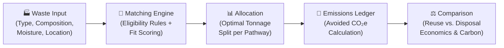
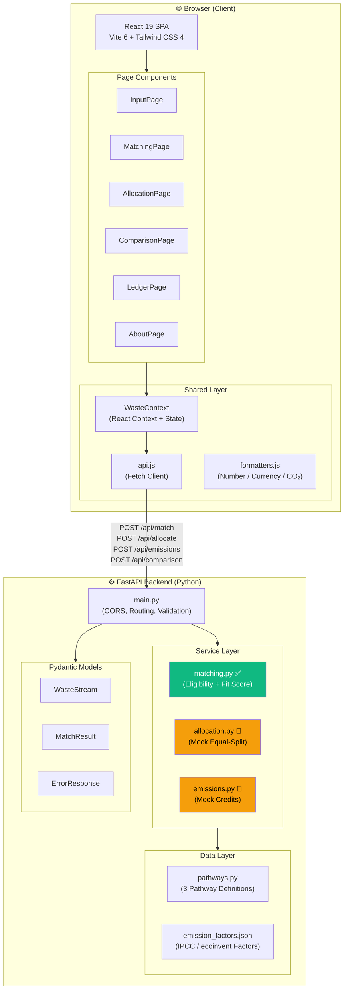
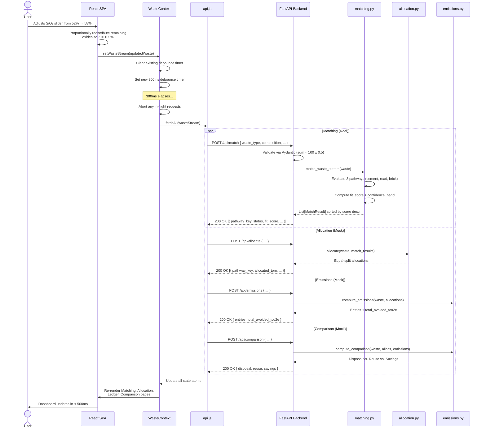
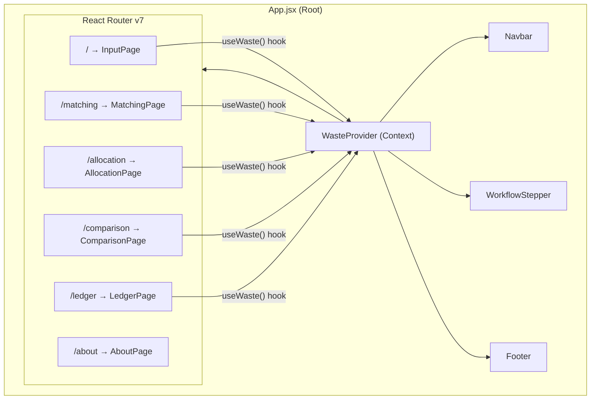
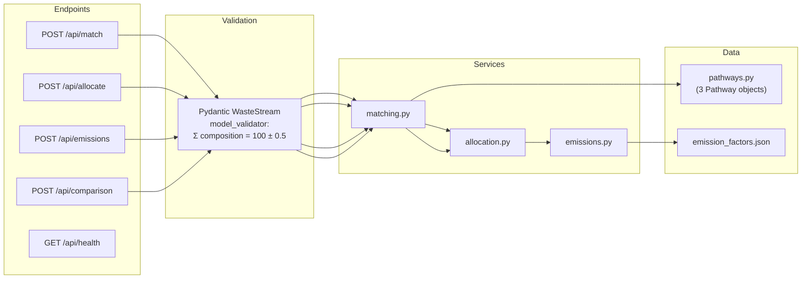

<div align="center">

# ♻️ Circularity Twin

### Industrial Waste Reuse Decision Platform

**Turning waste streams into circular-economy pathways — with deterministic scoring, auditable carbon accounting, and standards-aligned eligibility rules.**

[](#tech-stack)
[](#tech-stack)
[](#tech-stack)
[](#tech-stack)
[](#tech-stack)
[](#license)

> **HackMatrix 5.0 — PCCOE | Problem Statement ENR-04**

</div>

---

## Table of Contents

- [Problem Statement](#-problem-statement-enr-04)
- [The Core Challenge](#-the-core-challenge)
- [How Circularity Twin Solves It](#-how-circularity-twin-solves-it)
- [Feature Overview](#-feature-overview)
- [System Architecture](#-system-architecture)
  - [High-Level Architecture Diagram](#high-level-architecture-diagram)
  - [Data Flow Diagram](#data-flow-diagram)
  - [Frontend Component Architecture](#frontend-component-architecture)
  - [Backend Service Architecture](#backend-service-architecture)
- [Technical Deep-Dive: Matching Engine](#-technical-deep-dive-matching-engine)
  - [Pathway 1 — Cement / Concrete Substitution](#pathway-1--cement--concrete-substitution-supplementary-cementitious-material)
  - [Pathway 2 — Road Sub-base / Embankment Fill](#pathway-2--road-sub-base--embankment-fill)
  - [Pathway 3 — Brick / Block Manufacturing](#pathway-3--brick--block-manufacturing)
  - [Confidence Bands](#confidence-bands)
  - [Worked Example](#worked-example)
- [Technical Deep-Dive: Emissions Methodology](#-technical-deep-dive-emissions-methodology)
  - [Core Avoided-Emissions Formula](#core-avoided-emissions-formula)
  - [Displacement Credit Factors](#displacement-credit-factors)
  - [Reuse vs. Disposal Comparison](#reuse-vs-disposal-comparison)
- [Technical Deep-Dive: Allocation Engine](#-technical-deep-dive-allocation-engine)
- [Data Models & API Reference](#-data-models--api-reference)
  - [WasteStream Schema](#wastestream-input-schema)
  - [MatchResult Schema](#matchresult-response-schema)
  - [API Endpoints](#api-endpoints)
- [Module Implementation Status](#-module-implementation-status)
- [Project Structure](#-project-structure)
- [Tech Stack](#-tech-stack)
- [Getting Started](#-getting-started)
- [Environment Variables](#-environment-variables)
- [Testing Strategy](#-testing-strategy)
- [Key Design Decisions](#-key-design-decisions)
- [Roadmap & Future Work](#-roadmap--future-work)
- [Contributing](#-contributing)
- [License](#-license)

---

## 🎯 Problem Statement: ENR-04

> **ENR-04: Industrial Waste Reuse & Circular-Economy Optimization**

Heavy industries — power generation (thermal power plants), metallurgy (steel mills, smelters), and mining — produce **millions of tonnes** of solid by-products every year:

| Industrial Sector | Typical By-Product | India Annual Output (approx.) |
| :--- | :--- | ---: |
| Thermal Power | Coal Fly Ash | ~250 Mt |
| Iron & Steel | Blast Furnace Slag | ~30 Mt |
| Mining / Mineral Processing | Tailings | ~500+ Mt |

Most of this waste is either stored in ash ponds, dumped in landfills, or accumulated in tailing dams — occupying thousands of hectares of land, contaminating groundwater, and contributing to particulate air pollution.

**Simultaneously**, downstream industries — construction, cement manufacturing, road building — extract and consume billions of tonnes of virgin raw materials (limestone, clay, crushed stone) every year, each tonne carrying its own carbon footprint from quarrying, calcination, and transport.

---

## 🔥 The Core Challenge

There exists a **profound information asymmetry** between waste producers and potential waste consumers:

```
┌────────────────────────┐          ❓ GAP ❓           ┌────────────────────────┐
│  WASTE PRODUCER        │                               │  POTENTIAL CONSUMER    │
│  (Thermal Power Plant) │  "Is my fly ash suitable?"    │  (Cement Factory)      │
│                        │  "Which pathway is optimal?"  │                        │
│  - Has: 2000 t/mo ash  │  "How much CO₂ do I save?"    │  - Needs: SiO₂ > 70%   │
│  - SiO₂: 52%           │  "What's the net benefit?"    │  - CaO < 15%           │
│  - Al₂O₃: 26%          │                               │  - Low moisture        │
│  - Moisture: 12%       │  No standardized platform     │                        │
│                        │  to answer these questions    │                        │
└────────────────────────┘  in real-time.                └────────────────────────┘
```

**Specific pain points:**
1. **Chemical complexity** — Determining if a waste stream (e.g., SiO₂ = 52%, Al₂O₃ = 26%, Fe₂O₃ = 8%, CaO = 9%) meets ASTM C618 or IS 3812 thresholds requires domain expertise.
2. **Multi-pathway routing** — A single waste batch may be partially suitable for cement AND bricks. Optimal split requires optimization.
3. **Carbon accounting** — Quantifying avoided emissions (displacement credits minus process & transport emissions) requires LCA (Life Cycle Assessment) data.
4. **Speed** — Manual analysis takes days/weeks. An industrial plant generates waste continuously.

---

## 💡 How Circularity Twin Solves It

Circularity Twin is a **real-time digital twin** for industrial waste streams. It provides an end-to-end decision pipeline:



| Step | What Happens | Status |
| :--- | :--- | :---: |
| **1. Input** | User provides waste type (fly ash / slag / tailings), chemical composition (oxide %), moisture %, quantity (t/mo), and source location. | ✅ Fully Implemented |
| **2. Matching** | The engine evaluates every registered reuse pathway against the waste's chemistry, producing a three-tier status (`eligible` / `marginal` / `ineligible`) and a deterministic 0–100 fit score. | ✅ Fully Implemented |
| **3. Allocation** | Tonnage is allocated across eligible pathways to maximize net economic benefit subject to capacity and eligibility constraints. | 🚧 Mock (LP Planned) |
| **4. Emissions Ledger** | For each allocated pathway, avoided CO₂e is computed using industry emission factors (IPCC AR6, ecoinvent). | 🚧 Mock (Real LCA Planned) |
| **5. Comparison** | Side-by-side comparison of the "reuse" scenario vs. the "landfill disposal" baseline, showing cost savings and carbon impact. | 🚧 Mock (Wiring Planned) |

---

## ✨ Feature Overview

### Implemented Features

- **🔬 Deterministic Mathematical Scoring** — Fit scores use explicit clamped-linear formulas with zero randomness. Results are reproducible and audit-ready. Every formula is documented in source code and in this README.
- **📋 Standards-Aligned Eligibility Rules** — Pathway thresholds are drawn from published industry standards:
  - ASTM C618 & IS 3812:2013 (cement pozzolan requirements)
  - IRC SP-58:2001 & FHWA guidelines (road sub-base moisture limits)
  - IS 12894:2002 (fly ash brick silicate requirements)
- **🎛️ Interactive Composition Sliders** — Adjusting one chemical component automatically redistributes the delta proportionally across remaining components to maintain ∑ = 100%.
- **⚡ Real-Time Reactive UI** — A 300ms debounce on input changes triggers parallel API calls. The entire dashboard updates in under 500ms.
- **📍 Preset Industrial Sites** — Quick-select from major Indian industrial locations (NTPC Ramagundam, Tata Steel Jamshedpur, Vedanta Lanjigarh, JSW Bellary).
- **📏 Consistent Error Handling** — All API validation errors return a uniform `{ "error": string, "field": string }` JSON shape, enabling the frontend to render field-specific error indicators.
- **🧪 Comprehensive Test Suite** — 15+ pytest cases covering eligible/ineligible/marginal classification for every pathway, validation edge cases, error shape consistency, and determinism guarantees.

### Planned Features (Roadmap)

- **📈 Linear Programming Optimizer** — Replace mock equal-split allocation with `scipy.optimize.linprog` or PuLP-based tonnage optimization.
- **🌍 Real LCA Emission Factors** — Wire emission calculations to the `emission_factors.json` data file with site-specific factors.
- **🗺️ Geospatial Routing** — Calculate real transport distances using great-circle or road-network distances instead of a flat 50km assumption.
- **🔐 Database Persistence** — Migrate from in-memory state to PostgreSQL for historical tracking and multi-user support.

---

## 🏗️ System Architecture

### High-Level Architecture Diagram



### Data Flow Diagram

The following diagram traces the complete journey of a user interaction from slider adjustment to rendered result:



### Frontend Component Architecture



### Backend Service Architecture



---

## 🔬 Technical Deep-Dive: Matching Engine

The matching engine ([`matching.py`](backend/app/services/matching.py)) is the **fully implemented, production-ready core** of Circularity Twin. It evaluates a `WasteStream` against every registered `Pathway` and produces:

1. **Status** — A three-tier classification: `eligible`, `marginal`, or `ineligible`
2. **Fit Score** — A continuous 0–100 metric indicating how well the waste fits the pathway
3. **Confidence Band** — A ± value expressing boundary uncertainty

All scoring is **deterministic** (no randomness, no ML inference), making results fully reproducible and auditable.

### Pathway 1 — Cement / Concrete Substitution (Supplementary Cementitious Material)

**Industry Standard**: [ASTM C618](https://www.astm.org/c0618-23.html) — *Standard Specification for Coal Fly Ash and Raw or Calcined Natural Pozzolan for Use in Concrete*; [IS 3812:2013](https://www.services.bis.gov.in/) (Indian mirror standard).

**Chemical Rationale**: Portland cement production involves calcining limestone (CaCO₃ → CaO + CO₂), emitting ~0.6–0.9 tCO₂ per tonne of clinker. Fly ash with high pozzolanic activity (SiO₂ + Al₂O₃ + Fe₂O₃) can **replace up to 35%** of clinker in blended cement, avoiding the calcination emissions entirely.

#### Eligibility Rules

| Condition | Threshold | Classification |
| :--- | :--- | :---: |
| SiO₂ + Al₂O₃ + Fe₂O₃ > 70% **AND** CaO < 15% | Full ASTM C618 Class F compliance | ✅ **Eligible** |
| SiO₂ + Al₂O₃ + Fe₂O₃ ∈ [65%, 70%] **OR** CaO ∈ [15%, 20%] | Near-boundary, usable with blending | ⚠️ **Marginal** |
| Otherwise | Does not meet minimum pozzolanic criteria | ❌ **Ineligible** |

#### Fit Score Formula

The fit score maps the pozzolanic sum into a normalized 0–100 scale. Let:

$$P = \text{SiO}_2 + \text{Al}_2\text{O}_3 + \text{Fe}_2\text{O}_3$$

Then:

$$\text{Score}_{\text{cement}} = \text{clamp}\left(\frac{P - 60}{30} \times 100,\; 0,\; 100\right)$$

Where `clamp(x, lo, hi) = max(lo, min(hi, x))`.

**Interpretation**:
| Pozzolanic Sum (P) | Fit Score | Meaning |
| :---: | :---: | :--- |
| ≤ 60% | 0.0 | Far below any usability threshold |
| 70% | 33.3 | At the ASTM C618 Class F boundary |
| 80% | 66.7 | Good quality pozzolan |
| ≥ 90% | 100.0 | Exceptional ash (maximum score) |

### Pathway 2 — Road Sub-base / Embankment Fill

**Industry Standard**: [IRC SP-58:2001](https://irc.org.in/) — *Indian Roads Congress Guidelines for Use of Fly Ash in Road Embankments*; [FHWA-RD-97-148](https://www.fhwa.dot.gov/) (US Federal Highway Administration).

**Physical Rationale**: Road sub-base construction requires compaction to achieve target dry density. Excessive moisture prevents compaction, reducing bearing capacity and causing settlement. Materials with moisture > 27% require energy-intensive pre-drying or chemical stabilization (lime/cement).

#### Eligibility Rules

| Condition | Threshold | Classification |
| :--- | :--- | :---: |
| Moisture < 20% | Within Optimum Moisture Content (OMC) | ✅ **Eligible** |
| Moisture ∈ [20%, 27%] | Usable with lime stabilization | ⚠️ **Marginal** |
| Moisture > 27% | Unusable without expensive pre-treatment | ❌ **Ineligible** |

#### Fit Score Formula

Let $M$ = moisture percentage:

$$\text{Score}_{\text{road}} = \text{clamp}\left(\frac{30 - M}{30} \times 100,\; 0,\; 100\right)$$

**Interpretation**:
| Moisture (M) | Fit Score | Meaning |
| :---: | :---: | :--- |
| 0% | 100.0 | Perfectly dry — ideal for compaction |
| 10% | 66.7 | Good — within OMC range |
| 20% | 33.3 | At the eligible/marginal boundary |
| ≥ 30% | 0.0 | Too wet to compact (score bottoms out) |

### Pathway 3 — Brick / Block Manufacturing

**Industry Standard**: [IS 12894:2002](https://www.services.bis.gov.in/) — *Fly Ash-Lime-Gypsum Bricks — Specification*; BIS standards for autoclaved and pressed blocks.

**Chemical Rationale**: Silicate bonding (SiO₂ + Al₂O₃) is the structural backbone of fly ash bricks. During autoclaving or pressing, these oxides react with lime (CaO) and water to form calcium silicate hydrates (C-S-H), the same binder phase found in Portland cement. Insufficient silicate content produces weak, crumbly bricks.

#### Eligibility Rules

| Condition | Threshold | Classification |
| :--- | :--- | :---: |
| SiO₂ + Al₂O₃ > 55% | Adequate silicate for structural bonding | ✅ **Eligible** |
| SiO₂ + Al₂O₃ ∈ [50%, 55%] | May work with additives (gypsum, lime) | ⚠️ **Marginal** |
| SiO₂ + Al₂O₃ < 50% | Insufficient for any brick process | ❌ **Ineligible** |

#### Fit Score Formula

Let $S = \text{SiO}_2 + \text{Al}_2\text{O}_3$:

$$\text{Score}_{\text{brick}} = \text{clamp}\left(\frac{S - 45}{35} \times 100,\; 0,\; 100\right)$$

**Interpretation**:
| Silicate Sum (S) | Fit Score | Meaning |
| :---: | :---: | :--- |
| ≤ 45% | 0.0 | Far below structural requirements |
| 55% | 28.6 | At the eligible boundary |
| 65% | 57.1 | Good silicate content |
| ≥ 80% | 100.0 | Excellent (maximum score) |

### Confidence Bands

The confidence band quantifies **how certain** the classification is. A wider band means the waste is near a boundary where small compositional fluctuations could flip the result.

| Classification | Band Width | Rationale |
| :---: | :---: | :--- |
| ✅ Eligible | ±5.0 | Solidly above thresholds; minor variations won't change status |
| ⚠️ Marginal | ±10.0 | Near a boundary; the result is sensitive to measurement precision |
| ❌ Ineligible | ±0.0 | Clearly below thresholds; no ambiguity |

**Display**: The UI can show the fit score as a range, e.g., `72.5 ± 5.0` → the true score likely falls in `[67.5, 77.5]`.

### Worked Example

**Input**: A fly ash sample from NTPC Ramagundam with the following composition:

| Oxide | Value |
| :--- | ---: |
| SiO₂ | 52.0% |
| Al₂O₃ | 26.0% |
| Fe₂O₃ | 8.0% |
| CaO | 9.0% |
| Other | 5.0% |
| **Σ** | **100.0%** |
| Moisture | 12.0% |

**Evaluation**:

| Pathway | Key Metric | Threshold Check | Status | Score Calculation | Fit Score | Band |
| :--- | :--- | :--- | :---: | :--- | ---: | ---: |
| Cement | P = 52+26+8 = 86% | P > 70 ✓, CaO=9 < 15 ✓ | ✅ | (86−60)/30 × 100 = 86.7 | **86.7** | ±5.0 |
| Road | M = 12% | M < 20 ✓ | ✅ | (30−12)/30 × 100 = 60.0 | **60.0** | ±5.0 |
| Brick | S = 52+26 = 78% | S > 55 ✓ | ✅ | (78−45)/35 × 100 = 94.3 | **94.3** | ±5.0 |

**Result**: This fly ash is eligible for **all three** pathways. It scores highest for Brick (94.3), then Cement (86.7), then Road (60.0). The matching engine returns these sorted by `fit_score` descending.

---

## 🌱 Technical Deep-Dive: Emissions Methodology

The emissions module ([`emissions.py`](backend/app/services/emissions.py)) computes the **net avoided CO₂-equivalent emissions** achieved by diverting waste from landfill into productive reuse. The methodology follows the *displacement/substitution approach* used in LCA (Life Cycle Assessment).

### Core Avoided-Emissions Formula

For each pathway allocation:

$$\text{Avoided}_{i} = \underbrace{d_i \times Q_i}_{\text{Displacement Credit}} - \underbrace{p \times Q_i}_{\text{Process Emissions}} - \underbrace{t \times D \times Q_i}_{\text{Transport Emissions}}$$

Where:

| Symbol | Definition | Unit |
| :---: | :--- | :---: |
| $d_i$ | Displacement credit factor for pathway $i$ | tCO₂e / t |
| $Q_i$ | Quantity allocated to pathway $i$ | t / month |
| $p$ | Process emission factor (grinding, mixing, curing) | tCO₂e / t |
| $t$ | Transport emission factor | tCO₂e / t·km |
| $D$ | Distance from waste source to reuse facility | km |
| $\text{Avoided}_i$ | Net avoided emissions for pathway $i$ | tCO₂e / month |

**Total avoided**:

$$\text{Total Avoided} = \sum_{i=1}^{n} \text{Avoided}_i$$

### Displacement Credit Factors

These values represent the CO₂ emissions that are **prevented** by using industrial waste instead of extracting and processing virgin materials.

| Pathway | Credit $d_i$ (tCO₂e/t) | What It Displaces | Source |
| :--- | :---: | :--- | :--- |
| Cement Substitution | **0.83** | Portland cement clinker (calcination of CaCO₃) | IPCC AR6 WG III, Table 11.3 |
| Road Sub-base | **0.03** | Crushed stone aggregate (low-energy material) | Approximate (quarry energy) |
| Brick Manufacturing | **0.15** | Fired clay bricks (kiln energy avoided) | ecoinvent 3.9 |

**Other factors used in calculations**:

| Factor | Value | Unit | Source |
| :--- | :---: | :---: | :--- |
| Process emissions ($p$) | 0.02 | tCO₂e / t | Mock estimate |
| Transport emissions ($t$) | 0.0001 | tCO₂e / t·km | European avg. loaded truck |
| Landfill disposal emissions | 0.05 | tCO₂e / t | CPCB India reports |
| Landfill disposal cost | 18.0 | ₹ / t | Industry average |

### Reuse vs. Disposal Comparison

The comparison engine ([`compute_comparison()`](backend/app/services/emissions.py)) generates a side-by-side view:

$$\Delta_{\text{cost}} = R_{\text{reuse}} - C_{\text{reuse}} - C_{\text{landfill}}$$

$$\Delta_{\text{emissions}} = \text{Avoided}_{\text{reuse}} + E_{\text{landfill}}$$

Where:
- $R_{\text{reuse}}$ = total revenue from selling reused material
- $C_{\text{reuse}}$ = processing cost + transport cost
- $C_{\text{landfill}}$ = cost of landfill disposal (baseline)
- $E_{\text{landfill}}$ = emissions from landfilling (transport to dump + compaction)

A **positive** $\Delta_{\text{cost}}$ means reuse is economically profitable compared to disposal.
A **positive** $\Delta_{\text{emissions}}$ means reuse avoids more CO₂ than disposal emits.

---

## 📊 Technical Deep-Dive: Allocation Engine

> **Status: 🚧 Mock Implementation** — Currently uses naive equal-split. The planned real implementation will use Linear Programming.

The allocation engine ([`allocation.py`](backend/app/services/allocation.py)) answers: *"Given Q tonnes per month of waste, how much should go to each eligible pathway?"*

### Current (Mock) Logic

```python
share = quantity_tpm / len(eligible_pathways)  # Equal split
```

For each eligible pathway, the mock computes:

| Field | Formula (Mock) |
| :--- | :--- |
| `allocated_tpm` | $Q / n$ where $n$ = number of eligible pathways |
| `revenue` | $\text{share} \times 33.0$ |
| `proc_cost` | $\text{share} \times 12.0$ |
| `transport_cost` | $\text{share} \times 0.1 \times 50$ (assumed 50km) |
| `net_benefit` | $\text{revenue} - \text{proc\_cost} - \text{transport\_cost}$ |

### Planned (Real) LP Formulation

The real optimizer will solve the following linear program:

**Decision Variables**: $x_i$ = tonnes allocated to pathway $i$

**Objective** (Maximize net benefit):

$$\max \sum_{i=1}^{n} \left[ (r_i - c_i) \cdot x_i - f_i \cdot d_i \cdot x_i \right]$$

**Subject to**:

$$\sum_{i=1}^{n} x_i \leq Q \quad \text{(total tonnage constraint)}$$

$$0 \leq x_i \leq \text{cap}_i \quad \forall\, i \quad \text{(pathway capacity constraints)}$$

$$x_i = 0 \quad \text{if pathway } i \text{ is ineligible}$$

Where:

| Symbol | Definition | Stored In |
| :---: | :--- | :--- |
| $r_i$ | Revenue per tonne for pathway $i$ | `Pathway.revenue_per_tonne` |
| $c_i$ | Processing cost per tonne | `Pathway.proc_cost_per_tonne` |
| $f_i$ | Distance cost factor | `Pathway.distance_cost_factor` |
| $d_i$ | Distance to facility (km) | Computed from coordinates |
| $\text{cap}_i$ | Capacity limit of facility $i$ | Future config |

**Planned solver**: [`scipy.optimize.linprog`](https://docs.scipy.org/doc/scipy/reference/generated/scipy.optimize.linprog.html) or [PuLP](https://pypi.org/project/PuLP/).

### Pathway Economic Parameters

| Pathway | Processing Cost (₹/t) | Revenue (₹/t) | Distance Cost Factor (₹/t·km) | Displacement Credit (tCO₂e/t) |
| :--- | :---: | :---: | :---: | :---: |
| Cement / Concrete | 12.0 | 45.0 | 0.08 | 0.83 |
| Road Sub-base | 5.0 | 8.0 | 0.12 | 0.03 |
| Brick / Block | 8.0 | 22.0 | 0.10 | 0.15 |

---

## 📡 Data Models & API Reference

### WasteStream (Input Schema)

Defined in [`waste_stream.py`](backend/app/models/waste_stream.py) using Pydantic v2.

| Field | Type | Constraints | Description |
| :--- | :--- | :--- | :--- |
| `waste_type` | `enum` | `"flyash"` \| `"slag"` \| `"tailings"` | Type of industrial waste |
| `quantity_tpm` | `float` | `> 0` | Tonnes per month |
| `location` | `object` | `{ lat: [-90, 90], lng: [-180, 180] }` | Source coordinates |
| `composition` | `dict[str, float]` | Σ values = 100 ± 0.5 | Oxide percentages (e.g., SiO₂, Al₂O₃, Fe₂O₃, CaO, Other) |
| `moisture_pct` | `float` | `[0, 100]` | Moisture content percentage |

**Composition validation**: A `@model_validator(mode="after")` ensures:

$$\left| \sum_{k} \text{composition}[k] - 100.0 \right| \leq 0.5$$

### MatchResult (Response Schema)

| Field | Type | Description |
| :--- | :--- | :--- |
| `pathway_key` | `string` | Unique pathway identifier (e.g., `"cement"`) |
| `name` | `string` | Human-readable name |
| `requirement_description` | `string` | Summary of what the pathway requires |
| `status` | `enum` | `"eligible"` \| `"marginal"` \| `"ineligible"` |
| `fit_score` | `float [0, 100]` | Deterministic fit metric |
| `confidence_band` | `float ≥ 0` | ± uncertainty width |

### API Endpoints

| Method | Path | Status | Request Body | Response |
| :--- | :--- | :---: | :--- | :--- |
| `POST` | `/api/match` | ✅ Real | `WasteStream` JSON | `MatchResult[]` sorted by `fit_score` desc |
| `POST` | `/api/allocate` | 🚧 Mock | `WasteStream` JSON | `Allocation[]` with tonnage + economics |
| `POST` | `/api/emissions` | 🚧 Mock | `WasteStream` JSON | `{ entries[], total_avoided_tco2e, methodology_version }` |
| `POST` | `/api/comparison` | 🚧 Mock | `WasteStream` JSON | `{ disposal, reuse, savings }` |
| `GET` | `/api/health` | ✅ Real | — | `{ status: "ok", version: "0.1.0" }` |

**Error Response Shape** (all endpoints):

```json
{
  "error": "Composition percentages must sum to 100 ± 0.5, but got 90.00",
  "field": "composition"
}
```

---

## 📋 Module Implementation Status

| Layer | Module | File | Status | Notes |
| :--- | :--- | :--- | :---: | :--- |
| **Frontend** | Input Form | `InputPage.jsx` | ✅ | Composition sliders with proportional redistribution |
| **Frontend** | Matching Display | `MatchingPage.jsx` | ✅ | Live API calls, color-coded status badges |
| **Frontend** | Allocation View | `AllocationPage.jsx` | ✅ | Styled UI rendering mock data |
| **Frontend** | Emissions Ledger | `LedgerPage.jsx` | ✅ | Styled UI rendering mock data |
| **Frontend** | Comparison View | `ComparisonPage.jsx` | ✅ | Styled UI rendering mock data |
| **Frontend** | About / Methodology | `AboutPage.jsx` | ✅ | Static informational content |
| **Frontend** | Navigation | `Navbar.jsx` | ✅ | Sticky nav with active route highlighting |
| **Frontend** | Workflow Stepper | `WorkflowStepper.jsx` | ✅ | Visual pipeline progress indicator |
| **Frontend** | State Management | `WasteContext.jsx` | ✅ | React Context with debounced API calls |
| **Frontend** | API Client | `api.js` | ✅ | Fetch wrapper with custom `ApiError` class |
| **Frontend** | Formatters | `formatters.js` | ✅ | INR currency, tCO₂e, t/mo formatting + presets |
| **Backend** | App Entry | `main.py` | ✅ | CORS, routing, global error handler |
| **Backend** | Matching Engine | `matching.py` | ✅ | **Fully real** — deterministic eligibility + scoring |
| **Backend** | Allocation | `allocation.py` | 🚧 | Mock equal-split. TODO: LP optimizer |
| **Backend** | Emissions | `emissions.py` | 🚧 | Mock credits. TODO: wire `emission_factors.json` |
| **Backend** | Pathway Data | `pathways.py` | ✅ | 3 pathways with rules, costs, credits |
| **Backend** | Emission Factors | `emission_factors.json` | ✅ | Data ready (IPCC AR6, ecoinvent) — not yet wired |
| **Backend** | Pydantic Models | `waste_stream.py` | ✅ | WasteStream, MatchResult, ErrorResponse |
| **Backend** | Test Suite | `test_matching.py` | ✅ | 15+ cases: eligible/marginal/ineligible × 3 pathways |

---

## 📂 Project Structure

```
circularity--twin/
├── .env.example                    # Environment variable template
├── .gitignore                      # Python, Node, IDE, OS ignores
├── .github/
│   └── PULL_REQUEST_TEMPLATE.md    # PR checklist (tests, methodology, screenshots)
├── README.md                       # ← You are here
│
├── docs/
│   ├── architecture.md             # Architecture overview & section status matrix
│   ├── emissions-methodology.md    # Emissions formula, factors, assumptions
│   └── problem-statement.md        # ENR-04 problem statement (placeholder)
│
├── backend/
│   ├── pyproject.toml              # Build config, Python ≥ 3.10
│   ├── requirements.txt            # fastapi, uvicorn, pydantic, httpx, pytest
│   └── app/
│       ├── __init__.py
│       ├── main.py                 # FastAPI app: CORS, 4 POST endpoints, health check
│       ├── models/
│       │   ├── __init__.py
│       │   └── waste_stream.py     # WasteStream, MatchResult, MatchStatus, ErrorResponse
│       ├── services/
│       │   ├── __init__.py
│       │   ├── matching.py         # ✅ Real eligibility engine + fit scoring
│       │   ├── allocation.py       # 🚧 Mock equal-split allocator
│       │   └── emissions.py        # 🚧 Mock emissions + comparison calculator
│       ├── data/
│       │   ├── __init__.py
│       │   ├── pathways.py         # 3 Pathway definitions (rules + economics)
│       │   └── emission_factors.json  # IPCC AR6 / ecoinvent displacement credits
│       └── tests/
│           ├── __init__.py
│           └── test_matching.py    # 15+ test cases (eligible/marginal/ineligible/validation)
│
└── frontend/
    ├── index.html                  # Entry HTML (Inter + JetBrains Mono fonts)
    ├── package.json                # React 19, Vite 6, Tailwind CSS 4
    ├── vite.config.js              # Dev server on :5173, proxy /api → :8000
    └── src/
        ├── main.jsx                # React root with BrowserRouter
        ├── App.jsx                 # Layout: Navbar + Stepper + Router + Footer
        ├── index.css               # Global styles + design tokens
        ├── components/
        │   ├── Navbar.jsx          # Sticky top nav with route links
        │   └── WorkflowStepper.jsx # Horizontal step indicator (Input→Match→Alloc→…)
        ├── pages/
        │   ├── InputPage.jsx       # Waste type, quantity, location, composition sliders
        │   ├── MatchingPage.jsx    # Pathway cards with status + fit score
        │   ├── AllocationPage.jsx  # Tonnage allocation table + economics
        │   ├── ComparisonPage.jsx  # Reuse vs. Disposal side-by-side
        │   ├── LedgerPage.jsx      # CO₂e emissions audit trail
        │   └── AboutPage.jsx       # Methodology explanation + standards references
        └── lib/
            ├── WasteContext.jsx     # React Context provider + debounced API fetcher
            ├── api.js               # Fetch client (4 POST helpers + ApiError class)
            └── formatters.js        # Number, currency (₹), CO₂, TPM formatters + presets
```

---

## 🛠️ Tech Stack

| Layer | Technology | Version | Purpose |
| :--- | :--- | :---: | :--- |
| **Frontend Framework** | React | 19.1 | Component-based UI |
| **Build Tool** | Vite | 6.3 | Lightning-fast HMR & bundling |
| **Styling** | Tailwind CSS | 4.1 | Utility-first CSS framework |
| **Routing** | React Router | 7.18 | Client-side SPA navigation |
| **Fonts** | Inter + JetBrains Mono | — | UI typography + engineering/mono displays |
| **Backend Framework** | FastAPI | ≥ 0.100 | Async Python API framework |
| **ASGI Server** | Uvicorn | ≥ 0.23 | High-performance ASGI server |
| **Validation** | Pydantic | ≥ 2.0 | Data parsing, validation, serialization |
| **HTTP Client** | httpx | ≥ 0.24 | Async-capable HTTP client (testing) |
| **Testing** | pytest | ≥ 7.0 | Backend test framework |
| **Language** | Python | ≥ 3.10 | Backend runtime |

---

## 🚀 Getting Started

### Prerequisites

- **Python 3.10+** — [Download](https://www.python.org/downloads/)
- **Node.js 18+** — [Download](https://nodejs.org/)
- **npm** (comes with Node.js)

### 1. Clone the Repository

```bash
git clone https://github.com/atul-1603/circularity--twin.git
cd circularity--twin
```

### 2. Backend Setup (FastAPI)

```bash
cd backend

# Create and activate a virtual environment
python -m venv venv

# Windows:
venv\Scripts\activate
# macOS / Linux:
source venv/bin/activate

# Install dependencies
pip install -r requirements.txt

# Start the development server
uvicorn app.main:app --reload --port 8000
```

The API is now live at:
- **Base URL**: `http://localhost:8000`
- **Interactive Docs (Swagger)**: `http://localhost:8000/docs`
- **Health Check**: `http://localhost:8000/api/health`

### 3. Frontend Setup (React + Vite)

```bash
cd frontend

# Install Node.js dependencies
npm install

# Start the Vite dev server
npm run dev
```

The React SPA is now live at `http://localhost:5173`. The Vite dev server automatically proxies `/api/*` requests to the FastAPI backend on port 8000.

> **Note**: You must run `npm install` before `npm run dev`. The `vite` binary is a local dev dependency and won't be recognized until `node_modules` is populated.

### 4. Verify Everything Works

Open `http://localhost:5173` in your browser. You should see the Input form with pre-filled fly ash composition. Adjust any slider and watch the Matching results update in real-time.

---

## 🔐 Environment Variables

Copy `.env.example` to `.env` and customize as needed:

```bash
cp .env.example .env
```

| Variable | Default | Description |
| :--- | :--- | :--- |
| `FASTAPI_PORT` | `8000` | Port the backend listens on |
| `CORS_ORIGINS` | `http://localhost:5173` | Comma-separated allowed origins |
| `VITE_API_URL` | `http://localhost:8000/api` | Frontend API base URL |

---

## 🧪 Testing Strategy

The test suite ([`test_matching.py`](backend/app/tests/test_matching.py)) uses **pytest** with FastAPI's `TestClient` for integration testing.

### Test Coverage Matrix

| Test Class | Scenario | What It Validates |
| :--- | :--- | :--- |
| `TestCementPathway` | Clearly eligible (pozzolanic 86%, CaO 5%) | Status = `eligible`, score > 70 |
| `TestCementPathway` | Ineligible — low pozzolanic (40%) | Status = `ineligible` |
| `TestCementPathway` | Ineligible — high CaO (20%) with good pozzolanic | Status = `marginal` (CaO in 15–20 band) |
| `TestCementPathway` | Marginal — pozzolanic 68% (65–70 band) | Status = `marginal` |
| `TestRoadSubbasePathway` | Eligible — moisture 8% | Status = `eligible` |
| `TestRoadSubbasePathway` | Ineligible — moisture 35% | Status = `ineligible` |
| `TestRoadSubbasePathway` | Marginal — moisture 24% (20–27 band) | Status = `marginal` |
| `TestBrickPathway` | Eligible — silicate sum 78% | Status = `eligible` |
| `TestBrickPathway` | Ineligible — silicate sum 35% | Status = `ineligible` |
| `TestBrickPathway` | Marginal — silicate sum 53% (50–55 band) | Status = `marginal` |
| `TestValidation` | Composition sum = 90 (not 100) | HTTP 422, error mentions "90" |
| `TestValidation` | Quantity = 0 | HTTP 422 with `{ error, field }` shape |
| `TestValidation` | Quantity = -100 | HTTP 422 |
| `TestValidation` | Unknown waste type "unobtainium" | HTTP 422 with error |
| `TestValidation` | Error shape consistency | `body.error` is string, `body.field` is string |
| `TestDeterminism` | Same input twice | Identical JSON responses |

### Running Tests

```bash
cd backend
pytest app/tests/ -v
```

Expected output:

```
app/tests/test_matching.py::TestCementPathway::test_clearly_eligible PASSED
app/tests/test_matching.py::TestCementPathway::test_clearly_ineligible_low_pozzolanic PASSED
app/tests/test_matching.py::TestCementPathway::test_ineligible_high_cao PASSED
app/tests/test_matching.py::TestCementPathway::test_marginal_pozzolanic_band PASSED
app/tests/test_matching.py::TestRoadSubbasePathway::test_clearly_eligible_dry PASSED
...
```

---

## 🧠 Key Design Decisions

| Decision | Rationale |
| :--- | :--- |
| **Deterministic scoring (no ML/randomness)** | Industrial waste decisions must be auditable and reproducible. A regulatory body or site engineer should be able to verify the exact formula and replicate the score by hand. |
| **Clamped-linear scoring** | Simplicity and interpretability. A linear mapping from the threshold range to 0–100 is transparent and requires no tuning. Non-linear (sigmoid, power) models were considered and rejected for v0.1. |
| **Composition sum validation (100 ± 0.5)** | Chemical compositions must sum to 100% (accounting for rounding). The ±0.5 tolerance prevents frustrating UX from floating-point slider imprecision. |
| **Proportional redistribution** | When one slider moves, the remaining sliders adjust proportionally to their current values, maintaining the sum constraint smoothly. |
| **300ms debounce** | Balances responsiveness (user sees near-instant updates) against API load (avoids firing on every pixel of slider drag). |
| **Request abort on re-input** | Uses `AbortController` to cancel in-flight requests when the user changes input again, preventing race conditions where stale responses overwrite fresh ones. |
| **Consistent `{ error, field }` error shape** | A single normalized error format lets the frontend generically render field-level validation messages without per-endpoint error handling code. |
| **Proxy `/api` in Vite config** | Eliminates CORS issues during development by making the frontend and backend appear to share the same origin. |
| **In-memory stateless design** | No database dependency for the prototype. Every request is self-contained. This simplifies deployment and eliminates state management complexity for the hackathon scope. |
| **Separate mock services** | Allocation and emissions return realistic response shapes even though the numbers are mocked. This lets frontend and backend development proceed independently (contract-first design). |

---

## 🗺️ Roadmap & Future Work

| Priority | Feature | Description |
| :---: | :--- | :--- |
| 🔴 P0 | **Real LP Optimizer** | Replace mock `allocation.py` with `scipy.optimize.linprog` or PuLP, solving the constrained tonnage-routing problem. |
| 🔴 P0 | **Wire Emission Factors** | Connect `emissions.py` to `emission_factors.json` instead of hardcoded mock values. |
| 🟠 P1 | **Geospatial Distance** | Compute real transport distances using Haversine formula or road-network APIs instead of the flat 50km assumption. |
| 🟠 P1 | **Replacement Ratio** | Apply pathway-specific replacement ratios (e.g., 15–35% fly ash in blended cement) instead of assuming 1:1 mass substitution. |
| 🟡 P2 | **Database Persistence** | Migrate to PostgreSQL for storing historical waste evaluations, enabling trend analysis and audit trails. |
| 🟡 P2 | **User Authentication** | Add role-based access (plant operator, sustainability officer, regulator) with JWT tokens. |
| 🟢 P3 | **Additional Pathways** | Expand beyond 3 pathways — consider agriculture (soil amendment), geopolymer concrete, mine backfill, etc. |
| 🟢 P3 | **Site-Specific LCA** | Allow users to upload facility-specific emission factors instead of using global defaults. |
| 🟢 P3 | **PDF Report Export** | Generate downloadable audit-ready PDF reports with methodology citations. |
