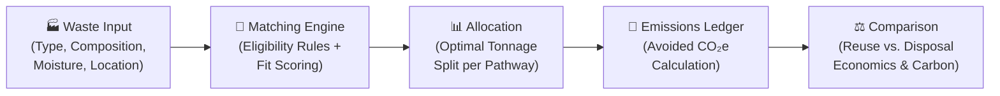
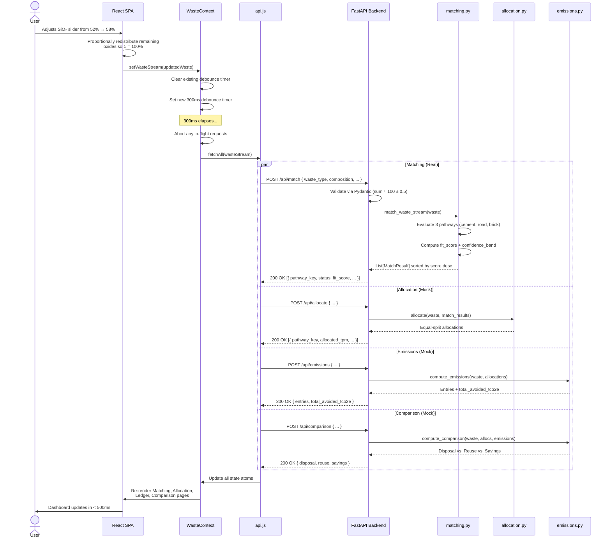

<div align="center">

# ♻️ Circularity Twin

### Industrial Waste Reuse Decision Platform

**Turning waste streams into circular-economy pathways - with deterministic scoring, auditable carbon accounting, and standards-aligned eligibility rules.**

> **HackMatrix 5.0 - PCCOE | Problem Statement ENR-04**

</div>

---

## Problem Statement: ENR-04

**ENR-04: Industrial Waste Reuse & Circular-Economy Optimization**

Heavy industries - power generation, metallurgy, and mining - produce **millions of tonnes** of solid by-products every year. Most of this waste is stored in ash ponds or dumped in landfills, causing pollution. Simultaneously, downstream industries - construction, cement manufacturing - consume billions of tonnes of virgin raw materials, each carrying a massive carbon footprint.

## The Core Challenge

There is a **profound information asymmetry** between waste producers (like a thermal power plant) and potential consumers (like a cement factory):

1. **Chemical complexity** - Is my fly ash suitable? Does it meet the chemical thresholds required for cement or bricks?
2. **Multi-pathway routing** - Which pathway is the optimal one for a given batch of waste?
3. **Carbon accounting** - How much CO₂ do we save by reusing this waste instead of extracting virgin materials?

Currently, there is no standardized, real-time platform to answer these questions. Manual analysis takes weeks, while industrial plants generate waste continuously.

## How Circularity Twin Solves It

Circularity Twin is a **real-time digital twin** for industrial waste streams. It provides an end-to-end decision pipeline to bridge the gap between waste producers and consumers.



1. **Input:** The user provides the waste type, chemical composition, moisture, quantity, and location.
2. **Matching:** Our deterministic engine evaluates the waste against published industry standards (like ASTM C618) to find eligible reuse pathways (e.g., Cement Substitution, Road Sub-base, Brick Manufacturing).
3. **Allocation:** Tonnage is optimized across eligible pathways to maximize economic benefit and reduce carbon footprint.
4. **Emissions Ledger:** The platform computes avoided CO₂-equivalent emissions using industry standard factors (IPCC, ecoinvent).
5. **Comparison:** Side-by-side comparison of the "reuse" scenario vs. the "landfill disposal" baseline, highlighting cost savings and carbon impact.

### Detailed Data Flow



## Core Concepts

To truly solve the circular-economy challenge, Circularity Twin relies on three major conceptual pillars:

### 1. Standards-Aligned Chemistry Matching
Not all waste is created equal. A batch of fly ash might look identical to the naked eye but have wildly different chemical properties. Our matching engine uses deterministic formulas based on real-world engineering standards:
- **Pozzolanic Reactivity (Cement):** We check if the sum of silicates and aluminates (SiO₂ + Al₂O₃ + Fe₂O₃) exceeds the 70% threshold required by ASTM C618. If it does, the ash can structurally replace cement.
- **Moisture & Compaction (Roads):** For road sub-bases, the physical moisture limit is critical. Waste with > 27% moisture cannot be compacted properly, making it ineligible for road construction without expensive thermal pre-drying.

### 2. LCA Displacement Credits (Carbon Accounting)
How do we calculate "saved" carbon? We use the Life Cycle Assessment (LCA) **displacement approach**. 
When 1 tonne of high-quality fly ash is routed to a cement factory, it *displaces* the need to mine, crush, and calcine 1 tonne of virgin limestone. Calcination inherently releases CO₂, so by substituting the material, we are granting a **displacement credit** (e.g., saving ~0.83 tCO₂e per tonne). We then subtract the minor emissions from transport to give a true "Net Avoided Emissions" figure.

### 3. Multi-Pathway Economic Optimization
A single thermal plant might produce 50,000 tonnes of ash a month. Some of it might be perfect for highly profitable Cement Substitution, but the local cement plant might only have a capacity of 20,000 tonnes. The Allocation Engine answers the question: *Where does the rest go?* It routes the remainder to the next best eligible pathways (like Brick Manufacturing or Road Sub-base) to maximize total economic revenue while minimizing landfill usage.

## 🚀 Getting Started

### Prerequisites
- **Python 3.10+**
- **Node.js 18+**

### 1. Clone the Repository
```bash
git clone https://github.com/atul-1603/circularity--twin.git
cd circularity--twin
```

### 2. Backend Setup
```bash
cd backend
python -m venv venv
# Windows: venv\Scripts\activate | macOS/Linux: source venv/bin/activate
pip install -r requirements.txt
uvicorn app.main:app --reload --port 8000
```

### 3. Frontend Setup
```bash
cd frontend
npm install
npm run dev
```
Access the application at `http://localhost:5173`.

## 🗺️ Roadmap & Future Work
- **Linear Programming Optimizer:** Optimize tonnage allocation across pathways.
- **Geospatial Distance:** Compute real transport distances using road-network APIs.
- **Database Persistence:** Migrate to PostgreSQL for storing historical evaluations.
- **Additional Pathways:** Expand beyond 3 pathways (e.g., agriculture, geopolymer concrete).
